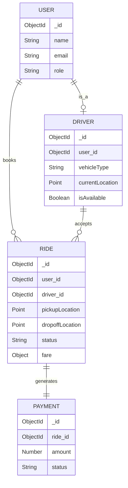

# Entity-Relationship (ER) Diagram

The Ucab database relies on interconnected collections. The relationships define how users interact with drivers via rides.

- **User**: Stores passenger credentials, payment methods, and wallet balance.
- **Driver**: References a User document for authentication, but extends it with vehicle details, verification status, and geospatial location tracking.
- **Ride**: The core transactional entity linking a User and a Driver. It stores pickup/dropoff coordinates, fare details, and timestamps.
- **Payment**: Tracks the financial transaction related to a specific Ride.

## ER Diagram

