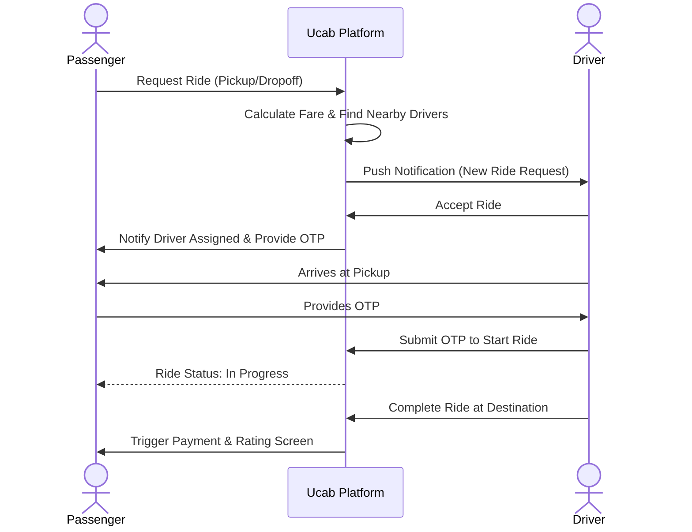

# User Flow

The typical journey of a booking request through the Ucab platform.

## Booking Flowchart

```mermaid
sequenceDiagram
    actor Passenger
    participant App as Ucab Platform
    actor Driver
    
    Passenger->>App: Request Ride (Pickup/Dropoff)
    App->>App: Calculate Fare & Find Nearby Drivers
    App->>Driver: Push Notification (New Ride Request)
    Driver->>App: Accept Ride
    App->>Passenger: Notify Driver Assigned & Provide OTP
    Driver->>Passenger: Arrives at Pickup
    Passenger->>Driver: Provides OTP
    Driver->>App: Submit OTP to Start Ride
    App-->>Passenger: Ride Status: In Progress
    Driver->>App: Complete Ride at Destination
    App->>Passenger: Trigger Payment & Rating Screen
```
