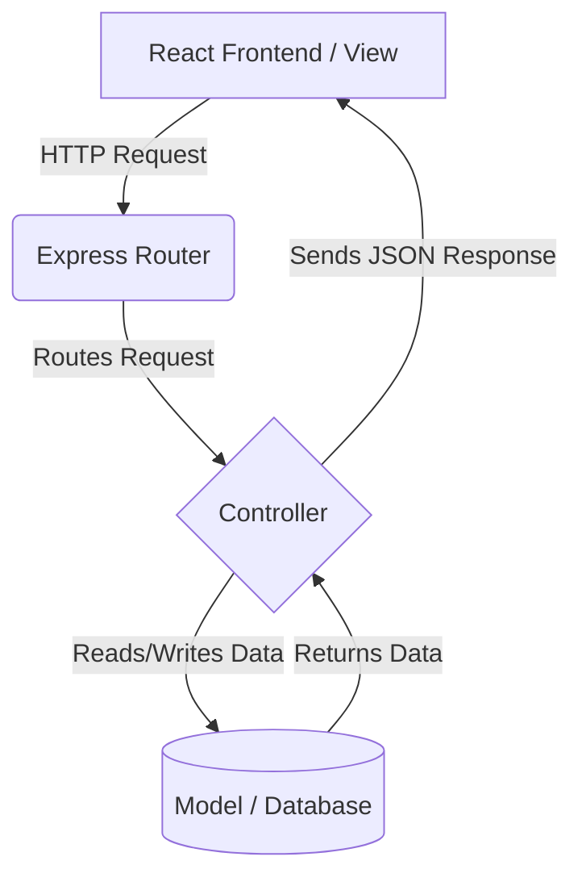

# MVC Pattern Implementation

The backend follows the Model-View-Controller (MVC) design pattern to maintain a clean separation of concerns.

- **Model (Data Layer):** Defined using Mongoose Schemas (e.g., `User.js`, `Ride.js`). Handles data validation, database interaction, and schema definitions.
- **View (Presentation Layer):** Handled entirely by the React frontend. The server acts purely as an API and does not render HTML directly.
- **Controller (Logic Layer):** Contains the core business logic (e.g., `rideController.js`). It processes incoming HTTP requests, queries the Models, and sends JSON responses back to the View.

## Architecture Flow

